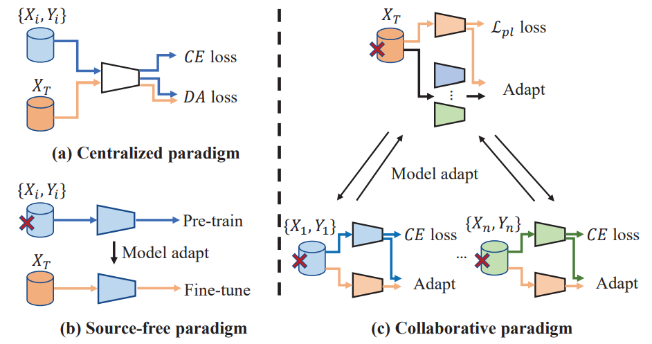
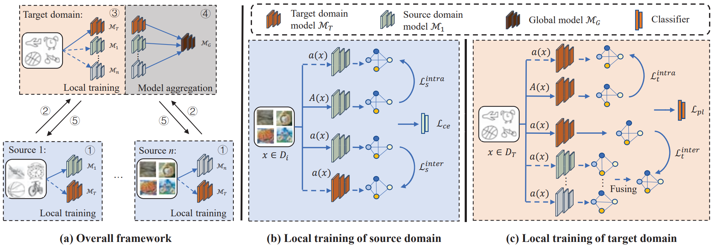
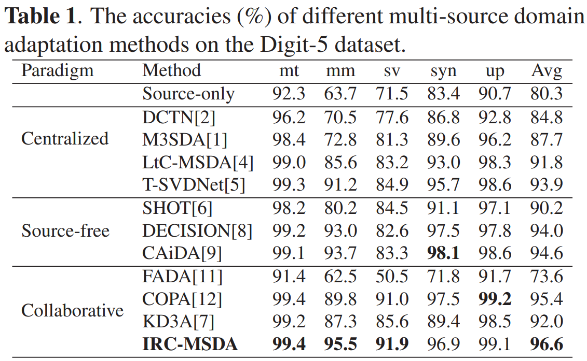
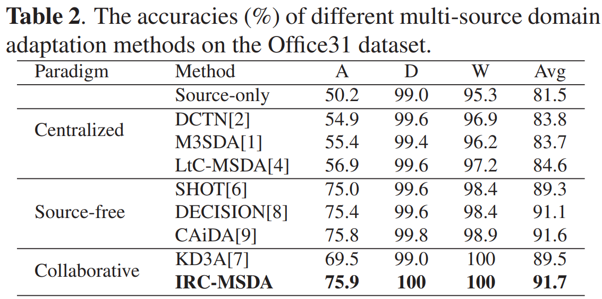
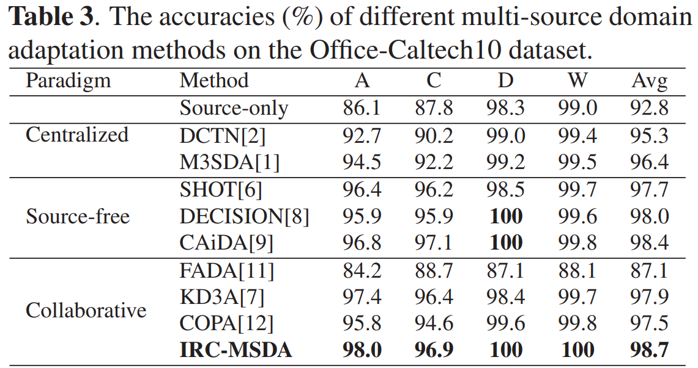

# Exploring Instance Relation for Decentralized Multi-Source Domain Adaptation
Here is the official implementation of the model `IRC-MSDA` in paper "Exploring Instance Relation for Decentralized Multi-Source Domain Adaptation", ICASSP 2023. [paper](https://ieeexplore.ieee.org/abstract/document/10096982), [youtube](https://www.youtube.com/watch?v=oCGEhTlYx2c)

## Abstract
Multi-source domain adaptation aims to transfer knowledge from multiple labeled source domains to an unlabeled target domain and reduce the domain shift. Considering data privacy and storage cost, the data from different domains are isolated, which leads to the difficulty of domain adaptation. To reduce the domain shift on the decentralized source domains and target domain, we propose an instance relation consistency method for decentralized multi-source domain adaptation. Specifically, we utilize the models from other domains as bridges to conduct domain adaptation. We impose inter-domain instance relation consistency on the isolated source and target domain to transfer the semantic relation knowledge across different domain models. Meanwhile, we exploit intra-domain instance relation consistency to learn the intrinsic semantic relation across different data views. Experiments on three benchmarks indicate the effectiveness of our method for decentralized multi-source domain adaptation.

## Different paradigm of domain adaptation

  

According to the paradigms of different MSDA setups, existing MSDA can be categorized into three paradigms, as shown in Figure 1.
* (a)	Centralized paradigm, which assumes that the source domain and target domain can be accessed simultaneously for conducting domain alignment.
* (b)	Source-free paradigm, which firstly pre-trains the source models only on the source domain and then fine-tunes the pre-trained source models on the unlabeled target domain to transfer knowledge.
* (c)	Collaborative paradigm, which collaboratively trains the decentralized source domains and target domain under the federated learning paradigm, e.g. FedAvg by local training and global model aggregation.

In this work, we utilize the collaborative paradigm to solve the decentralized multi-source unsupervised domain adaptation.


## Method

  

Our method has the following motivations.
* (1) Data from different domains can not be exchanged, which brings a great challenge for reducing the domain gap between source domains and target domain. So we use the models from other domains as bridges for transferring knowledge and conducting domain alignment.
* (2) Considering the intrinsic semantic relationships among samples should be invariant across different domains, we propose inter-domain instance relation consistency to transfer the instance relationships across different domain models. 
* (3) Considering the semantic relationships among samples should be invariant to the changing of data views, we propose intra-domain instance relation consistency to learn the invariant instance relationships across different views of samples.

## Setup
### Install Package Dependencies
```
Python Environment: >= 3.6
torch >= 1.2.0
torchvision >= 0.4.0
tensorbard >= 2.0.0
numpy
yaml
```
### Install Datasets
Please prepare the Digits-5, Office-Caltech10, Office31, and DomainNet dataset for MSDA task.
```
base_path
│       
└───dataset
│   │   pacs
│       │   images
│       │   splits
│   │   office_home_dg
│       │   art
│       │   clipart
│       │   product
│       │   real_world
│   │   DigitFive
│       │   ...
│   │   OfficeCaltech10
│       │   ...
```
<!-- Our framework now support four multi-source domain adaptation datasets: ```DigitFive, DomainNet, OfficeCaltech10 and Office31```. -->

<!-- * PACS

  The PACS dataset can be accessed in [Google Drive](https://drive.google.com/file/d/1QvC6mDVN25VArmTuSHqgd7Cf9CoiHvVt/view?usp=sharing). -->

### IRC-MSDA
The configuration files can be found under the folder  `./config`, and we provide four config files with the format `.yaml`. To perform the FedDA on the specific dataset (e.g., Digits-5), please use the following commands:

```python
nohup python main.py --config DigitFive.yaml --target-domain mnist -bp ../../../ --temperature 0.8 --s_intra 0.0 --s_inter 0.0 --t_intra 0.0 --t_inter 0.3 --pl 3 --pj 0 --gpu 6  > ./log/baseline_mnist_wgcc_sg00_sl00_tg03_tl00.txt 2>&1 &

nohup python main.py --config DigitFive.yaml --target-domain mnistm -bp ../../../ --temperature 0.8 --s_intra 0.0 --s_inter 0.0 --t_intra 0.0 --t_inter 0.0 --pl 3 --pj 0 --gpu 5  > ./log/baseline_mnistm_wgcc_sg00_sl00_tg00_tl03.txt 2>&1 &

nohup python main.py --config DigitFive.yaml --target-domain svhn -bp ../../../ --temperature 0.8 --s_intra 0.0 --s_inter 0.0 --t_intra 0.0 --t_inter 0.0 --pl 3 --pj 0 --gpu 6  > ./log/baseline_svhn_wgcc_sg00_sl00_tg00_tl03.txt 2>&1 &

nohup python main.py --config DigitFive.yaml --target-domain syn -bp ../../../ --temperature 0.8 --s_intra 0.0 --s_inter 0.0 --t_intra 0.3 --t_inter 0.0 --pl 3 --pj 0 --gpu 3  > ./log/baseline_syn_wgcc_sg00_sl00_tg00_tl03.txt 2>&1 &

nohup python main.py --config DigitFive.yaml --target-domain usps -bp ../../../ --temperature 0.8 --s_intra 0.0 --s_inter 0.0 --t_intra 0.0 --t_inter 0.3 --pl 3 --pj 0 --gpu 6  > ./log/baseline_usps_wgcc_sg00_sl00_tg03_tl00.txt 2>&1 &
```

The trained model on Digits-5 dataset can be downloaded in Baidu Yun:

Link: 
Code: 

The results on Digits-5, Office-Caltech10, and Office31 are as follows.

  

  

  

## Reference

If you find this useful in your work please consider citing:
```
@inproceedings{wei2023exploring,
  title={Exploring Instance Relation for Decentralized Multi-Source Domain Adaptation},
  author={Wei, Yikang and Han, Yahong},
  booktitle={ICASSP 2023-2023 IEEE International Conference on Acoustics, Speech and Signal Processing (ICASSP)},
  pages={1--5},
  year={2023},
  organization={IEEE}
}
```

And there are some federated multi-source domain adaptation and generalization methods proposed by us.
```
@article{wei2023multi,
  title={Multi-Source Collaborative Contrastive Learning for Decentralized Domain Adaptation}, 
  author={Wei, Yikang and Yang, Liu and Han, Yahong and Hu, Qinghua},
  journal={IEEE Transactions on Circuits and Systems for Video Technology}, 
  volume={33},
  number={5},
  pages={2202-2216},
  year={2023},
  doi={10.1109/TCSVT.2022.3219893}
}

@article{Wei_Han_2024, 
  title={Multi-Source Collaborative Gradient Discrepancy Minimization for Federated Domain Generalization},
  journal={Proceedings of the AAAI Conference on Artificial Intelligence}, 
  author={Wei, Yikang and Han, Yahong}, 
  volume={38}, 
  number={14}, 
  year={2024}, 
  month={Mar.}, 
  pages={15805-15813},
  DOI={10.1609/aaai.v38i14.29510} 
}

@article{wei2022dual,
  title={Dual collaboration for decentralized multi-source domain adaptation},
  author={Wei, Yikang and Han, Yahong},
  journal={Frontiers of Information Technology \& Electronic Engineering},
  volume={23},
  number={12},
  pages={1780--1794},
  year={2022},
  publisher={Springer}
}
```

## Acknowledgments
The codes will be released once they are annotated.
